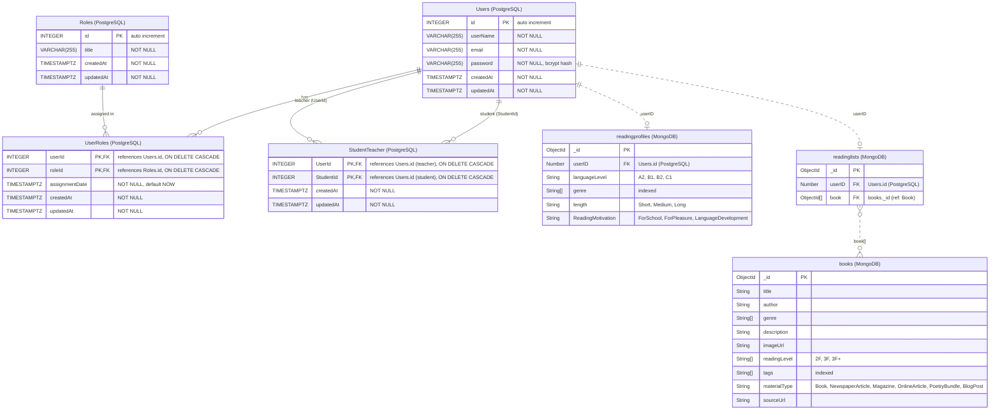

# Entity Relationship Diagram

The backend uses two databases:

- **PostgreSQL** (Sequelize): `Users`, `Roles`, `UserRoles`, `StudentTeacher`
- **MongoDB** (Mongoose): `books`, `readinglists`, `readingprofiles`

Solid lines are foreign keys enforced by PostgreSQL. Dashed lines are references stored by the
application: MongoDB does not enforce them, and the `userID` links cross from MongoDB to PostgreSQL.

## Notes

- `UserRoles` is the join table for the many-to-many relation between `Users` and `Roles`. Sequelize
  gives it a composite primary key (`userId`, `roleId`), so a user can have each role only once.
- `StudentTeacher` links teachers to students. It is a many-to-many from `Users` to itself;
  `UserId` is the teacher and `StudentId` the student (Sequelize's default names for
  `User.belongsToMany(User, {as: "Students", through: "StudentTeacher"})`).
- Mongoose adds a `__v` version key to every document; it is left out of the diagram.
- One reading list and one reading profile per user is the intended design (the API looks them up
  with `findOne`), but no unique index on `userID` enforces it yet.
